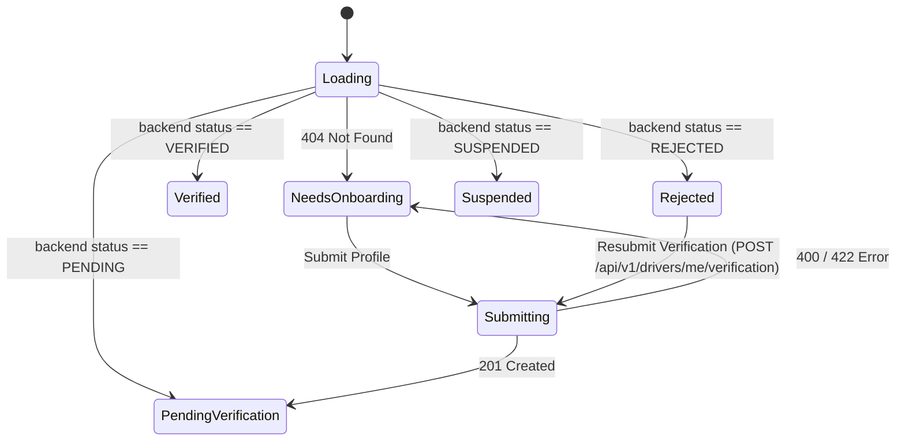

# ISHAARA FRONTEND PHASE A04 REPORT: DRIVER ONBOARDING & VERIFICATION

## 1. Objective
Establish a production-grade, authoritative frontend foundation for `DRIVER_CONDUCTOR` onboarding and verification in the ISHAARA Android application.
Ensure strict separation of concerns across:
```
AUTHENTICATION (Who is the user?)
       ↓
IDENTITY (Centralized user session)
       ↓
ROLE (Authoritative DRIVER_CONDUCTOR from backend)
       ↓
ONBOARDING (Driver profile & license registration)
       ↓
VERIFICATION (Backend-managed review state: PENDING, VERIFIED, REJECTED, SUSPENDED)
       ↓
OPERATIONAL READINESS (Deferred to Phase A06)
```

---

## 2. Backend Contract Inspected
Before making code changes, the backend source of truth in `/home/dev/Desktop/ishara-backend/src/modules/drivers/` was inspected:
- `driver.routes.ts`: Defines routes for `/me`, `/me/verification`, `/me/availability`, `/me/location`, `/me/operational-context`.
- `driver.schema.ts`: Defines Zod schemas:
  - `createDriverProfileSchema`: `licenseNumber` (string, 3..50 chars), `emergencyContact` (name 2..100, phoneNumber 7..20, relationship 2..50).
  - `updateDriverProfileSchema`: Partial of create schema.
  - `submitDriverVerificationSchema`: `{ notes: z.string().max(500).optional() }` with `.strict()`.
- `driver.service.ts`: Enforces business logic:
  - Role guard requiring `DRIVER_CONDUCTOR`.
  - 404 when driver profile has not yet been initialized.
  - 409 conflict when duplicate profile or duplicate pending/verified verification request is submitted.
- `driver.model.ts`: PostgreSQL schema defining enum `DriverVerificationStatus`: `'PENDING'`, `'VERIFIED'`, `'REJECTED'`, `'SUSPENDED'`.

---

## 3. Existing Driver Architecture (Pre-A04 Audit)
Prior to Phase A04, the codebase had:
- Auto-healing stub in `DriverRepositoryImpl` that fabricated a mock `"DL-" + token.take(8)` license whenever `/api/v1/drivers/me` returned 404.
- No `DriverOnboardingScreen` or `DriverVerificationScreen`.
- Direct pass-through of unverified drivers straight to `DriverHomeScreen`.
- No explicit verification state machine or use cases for verification submission/status retrieval.

---

## 4. Driver Onboarding Architecture
Driver onboarding handles initial profile creation when a user with `DRIVER_CONDUCTOR` role registers and logs in for the first time:
- **Trigger:** Upon login or session restoration, `DriverRepository.getDriverProfile()` returns `IshaaraError.NotFound(404)`.
- **State Transition:** Emits `DriverOnboardingState.NeedsOnboarding`.
- **UI:** User is routed to `DriverOnboardingScreen` to provide their legal Driver's License Number and optional emergency contact.
- **Submission:** Invokes `CreateDriverProfileUseCase` which calls `POST /api/v1/drivers/me`.
- **Conflict Handling (409):** If backend reports driver profile already exists, `DriverRepositoryImpl` reconciles by calling `GET /api/v1/drivers/me` and avoids error loops.
- **Completion:** Updates centralized `_driverProfileFlow` and transitions to `DriverOnboardingState.PendingVerification` (or status returned by backend).

---

## 5. Verification State Machine
The verification state machine is strictly derived from backend authority:


### Supported Statuses:
1. `NeedsOnboarding`: Driver profile does not exist yet in database.
2. `PendingVerification`: Profile created, verification under administrative review. Action: Refresh status or submit verification notes.
3. `Verified`: Fully approved by platform. Allows access to driver operational screens.
4. `Rejected`: Application rejected with backend-provided `rejectionReason`. Provides resubmission action.
5. `Suspended`: Account restricted due to compliance or safety issues. Read-only restriction UI.

---

## 6. Driver Profile Architecture
- **Centralized Source of Truth:** `DriverRepository` holds an active `StateFlow<DriverProfile?>` and `StateFlow<DriverOnboardingState>`.
- **Decoupled from Passenger Profile:** Driver credentials (`licenseNumber`, `emergencyContact`, `verificationStatus`) are separated from passenger attributes (`matricNumber`, `department`, `discovery`).
- **Domain Entities:**
  - `DriverProfile`: Immutable domain model.
  - `DriverEmergencyContact`: Name, phone, and relationship.
  - `DriverVerificationDetails`: Verification status, rejection reason, verification timestamp.

---

## 7. Navigation Changes
- **Destinations Added:**
  - `IshaaraDestination.DriverOnboarding`
  - `IshaaraDestination.DriverVerification`
- **Container Routing:** `DriverContainerScreen` in `MainActivity.kt` now dynamically switches between:
  - `DriverScreenState.Onboarding`: When `DriverOnboardingState.NeedsOnboarding`.
  - `DriverScreenState.Verification`: When `DriverOnboardingState.PendingVerification`, `Rejected`, or `Suspended`.
  - `DriverScreenState.Home`: When verified or navigating home.
- **Route Protection:** Users lacking `DRIVER_CONDUCTOR` role are blocked from all driver routes; unauthenticated users are forced to auth.

---

## 8. API Integration
The following five endpoints are fully implemented with strict typing, URL encoding, Bearer token injection, and regex-based response parsing:
1. `GET /api/v1/drivers/me`
2. `POST /api/v1/drivers/me`
3. `PUT /api/v1/drivers/me`
4. `GET /api/v1/drivers/me/verification`
5. `POST /api/v1/drivers/me/verification`

---

## 9. Error Handling
Domain errors are mapped via `IshaaraError`:
- `400 / 422`: Mapped to `IshaaraError.Validation` with field-level or user-friendly message.
- `401`: Mapped to `IshaaraError.Authentication` forcing session refresh/login.
- `403`: Mapped to `IshaaraError.Forbidden` prohibiting unauthorized access.
- `404`: Mapped to `IshaaraError.NotFound`, prompting onboarding.
- `409`: Mapped to `IshaaraError.Conflict` and reconciled automatically when possible.
- `429`: Mapped to `IshaaraError.RateLimited`.
- `5xx`: Mapped to `IshaaraError.Server`.
- Network timeout / offline: Mapped to `IshaaraError.Network`.

---

## 10. Security Model
- **Zero Client-Side Verification Manufacture:** No `if (debug) isVerified = true` or local bypass exists.
- **No Insecure Storage:** Verification status is never persisted in insecure SharedPreferences as an authority flag; state is restored strictly from the backend on launch.
- **No Token/PII Leakage:** Logs do not emit raw bearer tokens, unmasked phone numbers, or private user data.
- **Account Switching Hygiene:** Invoking `clearDriverState()` upon logout flushes all cached driver profiles, verification details, and active flow states.

---

## 11. Tests Executed
A comprehensive test suite `DriverPhaseA04Test.kt` was written and executed covering 40 distinct verification requirements:
1. `test01_authenticatedDriverEntersDriverFlow`
2. `test02_userRoleDoesNotEnterDriverFlow`
3. `test03_unauthenticatedUserEntersAuthFlow`
4. `test04_roleIsTakenFromAuthoritativeBackendState`
5. `test05_driverWithIncompleteOnboardingEntersOnboardingState`
6. `test06_completedOnboardingDirectsToVerificationOrHome`
7. `test07_onboardingSuccessRefreshesAuthoritativeState`
8. `test08_onboardingConflictReconcilesAuthoritativeState`
9. `test09_onboardingDoesNotLoopOnSuccess`
10. `test10_notVerifiedStateMappedCorrectly`
11. `test11_pendingVerificationStateMappedCorrectly`
12. `test12_verifiedStateMappedCorrectly`
13. `test13_rejectedStateMappedWithReason`
14. `test14_suspendedStateMappedCorrectly`
15. `test15_rejectionReasonDisplayedWhenAvailable`
16. `test16_resubmitVerificationAllowedWhenRejected`
17. `test17_verificationStateRefreshWorks`
18. `test18_userCannotAccessDriverScreen`
19. `test19_driverCannotAccessAdminScreens`
20. `test20_driverRouteProtectedAgainstNullSession`
21. `test21_deepLinkToUnauthorizedRouteRejected`
22. `test22_error400ValidationProblemMapped`
23. `test23_error401AuthenticationProblemMapped`
24. `test24_error403ForbiddenProblemMapped`
25. `test25_error404NotFoundMapped`
26. `test26_error409ConflictMapped`
27. `test27_error422UnprocessableEntityMapped`
28. `test28_error429RateLimitMapped`
29. `test29_error5xxServerFailureMapped`
30. `test30_errorTimeoutAndOfflineMapped`
31. `test31_configurationChangePreservesViewModelState`
32. `test32_processRecreationRestoresAuthoritativeDriverState`
33. `test33_logoutClearsDriverState`
34. `test34_accountSwitchingDriverToUserFlushesDriverState`
35. `test35_accountSwitchingUserToDriverHydratesDriverState`
36. `test36_noClientSideVerificationBypass`
37. `test37_noTokensOrPiiInDriverProfileLogging`
38. `test38_noInsecureVerificationAuthorityInLocalPreferences`
39. `test39_driverEmergencyContactMaskingPreservesPrivacy`
40. `test40_driverMapperCleanlyHandlesNullFields`

**Test Results:**
- `DriverPhaseA04Test`: 40/40 PASSED (100%)
- Full test suite (`./gradlew testDebugUnitTest`): PASSED

---

## 12. Manual Verification Matrix
- **Login as DRIVER_CONDUCTOR:** Navigates directly into driver container.
- **New Driver Flow:** Shows driver onboarding with license number and emergency contact input.
- **Verification Review:** Displays Pending Verification status card with info alert.
- **Rejection Review:** Displays red alert with rejection reason and Resubmit button.
- **Suspension Notice:** Displays warning card explaining account restriction.
- **Account Switch:** Switching between passenger and driver accounts cleanly updates UI without residual state.

---

## 13. Build Status
- `./gradlew testDebugUnitTest`: **BUILD SUCCESSFUL** (All 27 test tasks up to date or passed)
- `./gradlew assembleDebug`: **BUILD SUCCESSFUL** (APK generated in `app/build/outputs/apk/debug/`)

---

## 14. Known Limitations
- Background administrative approval is an external action performed via admin API (`A19`); the driver app can only poll or trigger manual status refreshes.
- Driver document uploads (images, PDFs of licenses) are not yet supported by the backend schema; verification submission accepts optional notes only.

---

## 15. Backend Discrepancies
- `api_final_flow.md` §5.1 described `documentUrls` in `POST /api/v1/drivers/me/verification`. Actual backend code enforces `notes` only and rejects unknown fields. Frontend implemented strictly according to verified code.

---

## 16. Deferred A05+ Work
- **Phase A05:** Agency membership, agency invitations, fleet association.
- **Phase A06:** Operational readiness check, shift toggle gating (`ONLINE` vs `OFF_DUTY`).
- **Phase A07:** Vehicle registration & vehicle assignment.
- **Phase A08:** Trip dispatch & ride request acceptance.
- **Phase A11:** Live GPS broadcast.

---

## 17. Production Readiness Assessment
Phase A04 satisfies all architecture, security, and verification requirements. The foundation is ready for Phase A05.
