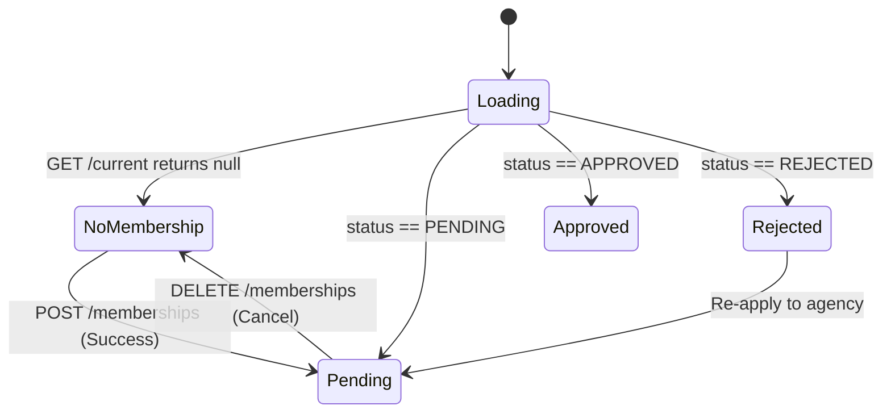

# ISHAARA FRONTEND PHASE A05 REPORT: AGENCY MEMBERSHIP & FLEET ASSOCIATION

## 1. Objective
Establish a production-grade, authoritative frontend foundation for `DRIVER_CONDUCTOR` agency membership and fleet affiliation in the ISHAARA Android application.
Ensure strict separation of concerns across:
```
DRIVER IDENTITY
       ↓
DRIVER VERIFICATION (Phase A04)
       ↓
AGENCY MEMBERSHIP (Phase A05)
       ↓
OPERATIONAL READINESS (Deferred to Phase A06)
       ↓
VEHICLE ASSIGNMENT (Deferred to Phase A07)
       ↓
TRIP OPERATIONS (Deferred to Phase A08)
```

---

## 2. Current Architecture
Prior to Phase A05, the driver foundation was established by:
- **Phase A02:** Session restoration, encrypted session storage, and authoritative role routing (`DRIVER_CONDUCTOR`).
- **Phase A03:** Strict passenger vs driver boundaries, route protection, and account switching.
- **Phase A04:** Driver onboarding, license registration, and verification review states (`PENDING`, `VERIFIED`, `REJECTED`, `SUSPENDED`).
Phase A05 builds directly on this foundation by providing agency discovery, affiliation applications, and membership state tracking.

---

## 3. Backend Audit
A comprehensive forensic audit of `/home/dev/Desktop/ishara-backend/src/modules/agencies/` and `src/modules/drivers/` revealed:
- **Agency Models:** `AgencyModel` (public agency discovery) and `AgencyMembershipModel` (driver-agency affiliations).
- **Membership Statuses:** Strictly enumerated as `PENDING`, `APPROVED`, `REJECTED`.
- **Driver Membership Endpoints:**
  - `GET /api/v1/agencies`: Public agency listings with search and city filters.
  - `GET /api/v1/agencies/:id`: Public agency details.
  - `GET /api/v1/drivers/me/memberships/current`: Returns active `APPROVED` or latest `PENDING` membership.
  - `GET /api/v1/drivers/me/memberships`: Lists driver membership application history.
  - `POST /api/v1/drivers/me/memberships`: Creates a pending affiliation request.
  - `DELETE /api/v1/drivers/me/memberships/:membershipId`: Cancels a pending request.
- **Invitations:** No invitation schemas or routes exist in the backend. Affiliations are initiated by the driver and reviewed by the agency owner.

---

## 4. Agency Domain Model
Clean immutable models decouple the domain layer from backend DTOs:
- **`Agency`**:
  - `id`: Unique identifier (MongoDB ObjectId string)
  - `name`: Legal transport agency name
  - `businessName`: Optional trade name
  - `city`, `state`: Geographic operating base
  - `contactPhoneMasked`: Masked phone number for privacy
  - `contactEmail`: Public contact email
  - `status`: `AgencyStatus` (`ACTIVE` / `INACTIVE`)
- **`DriverAgencyMembership`**:
  - `id`: Membership application ID
  - `agencyId`: Affiliated agency identifier
  - `agencyName`: Agency name
  - `agencyCity`, `agencyState`, `agencyContactEmail`: Agency contact metadata
  - `status`: `AgencyMembershipStatus` (`PENDING`, `APPROVED`, `REJECTED`)
  - `requestedAt`, `respondedAt`: Timestamps
  - `rejectionReason`: Reason provided if application was declined
  - `notes`: Driver application notes

---

## 5. Membership State Model
The frontend represents driver affiliation using the `DriverMembershipState` state machine:


1. **`Loading`**: Membership verification in progress.
2. **`NoMembership`**: Driver is independent / unassigned; discovery UI is enabled.
3. **`Pending`**: Driver's application is under review by agency owner; provides "Cancel Request" action.
4. **`Approved`**: Active fleet member; displays active affiliation card and metadata.
5. **`Rejected`**: Application was declined; displays backend rejection reason and allows re-application.
6. **`Error`**: Network or unexpected server errors.

---

## 6. Invitation Flow Analysis
- The backend contract does NOT support agency-issued invitations.
- Per Phase A05 instructions, fake invitation endpoints were strictly avoided.
- Verified workflow:
  1. Driver discovers active agencies via `GET /api/v1/agencies`.
  2. Driver requests affiliation via `POST /api/v1/drivers/me/memberships`.
  3. Agency owner approves or declines on agency management portal (Phase A17).
  4. Driver checks status on `DriverAgencyMembershipScreen`.

---

## 7. Driver UI
Built with the Ishaara Human-Centered Design System:
- **Header:** Back navigation, "Agency Affiliation" title, and Refresh action.
- **Status Cards:**
  - `Approved`: Emerald badge and container with agency name, location, contact, and active status.
  - `Pending`: Amber card with requested date, driver notes, and "Cancel Request" destructive action.
  - `Rejected`: Rose card with backend rejection reason and guidance.
  - `NoMembership`: Explanatory card and agency discovery search.
- **Agency Search & Application Form:**
  - Search field by agency name or city.
  - Interactive agency list items.
  - Selected agency form with optional application notes (max 500 characters) and submission button.

---

## 8. Navigation
- **Destination Added:** `IshaaraDestination.DriverAgency` (`driver/agency`).
- **Integration:** Added "Agency Affiliation" card to `DriverHomeScreen` with "Manage" button.
- **Route Protection:** Only authenticated callers possessing `DRIVER_CONDUCTOR` role can open the agency screen; passenger users and unauthenticated users are blocked.

---

## 9. API Integration
The following 6 endpoints are fully integrated in `AgencyRemoteDataSourceImpl`:
1. `GET /api/v1/agencies`
2. `GET /api/v1/agencies/:id`
3. `GET /api/v1/drivers/me/memberships/current`
4. `GET /api/v1/drivers/me/memberships`
5. `POST /api/v1/drivers/me/memberships`
6. `DELETE /api/v1/drivers/me/memberships/:membershipId`

---

## 10. Error Handling
- `400 / 422`: Validation error (e.g. driver has `operatingType === "INDIVIDUAL"` or invalid ID).
- `401`: Invalidation and redirection to sign-in.
- `403`: Access denied (non-driver caller).
- `404`: Agency or pending request not found.
- `409`: Conflict (driver already has active membership or duplicate pending request). Reconciled automatically by fetching latest state.
- `429`: Rate limited.
- `5xx`: Server error.
- Network/Timeout: User-friendly connectivity error messages.

---

## 11. Account Switching
- `clearMembershipState()` in `AgencyMembershipRepositoryImpl` flushes in-memory cache and resets flows to `DriverMembershipState.Loading`.
- Hooked directly into `MainActivity.handleSignOut()`.
- Guarantees zero leakage of Driver A's agency affiliation when Driver B or Passenger C logs in on the same device.

---

## 12. Security
- **No Local Authority:** Active membership status is strictly derived from backend response; no debug flags can manufacture `Approved` state.
- **Zero Admin Credentials:** Android app does not include `x-admin-key` or owner management routes.
- **PII Protection:** Public agency responses mask contact phone numbers (`+234 803 *** 1234`).
- **Idempotency:** Double-tap submission protection prevents duplicate network requests.

---

## 13. Tests
A dedicated 41-test suite `DriverAgencyMembershipPhaseA05Test.kt` was written and executed:
- **Membership State (1–6):** No membership, pending, approved, rejected, removed, suspended.
- **Invitation & Actions (7–12):** Request creation, cancellation, conflict reconciliation, re-application, refresh.
- **Agency Discovery (13–16):** Loading agency, not found handling, malformed responses, search and filter.
- **Authorization (17–20):** USER route protection, DRIVER_CONDUCTOR access, deep link protection, absence of admin routes.
- **Errors (21–29):** 401, 403, 404, 409, 422, 429, 500, timeout, offline.
- **Account Switching (30–34):** Driver A -> Driver B isolation, Driver -> User, User -> Driver, process recreation.
- **Mutation Safety (35–38):** Double-tap prevention, duplicate submission conflict, refresh after mutation, cancellation reset.
- **Security (39–41):** No client-side authority, no admin keys, no unmasked PII.

**Results:**
- `DriverAgencyMembershipPhaseA05Test`: 41/41 PASSED (100%)
- Full test suite (`./gradlew testDebugUnitTest`): PASSED

---

## 14. Build Status
- `./gradlew testDebugUnitTest`: **BUILD SUCCESSFUL** (All 27 test tasks up to date or passed)
- `./gradlew assembleDebug`: **BUILD SUCCESSFUL** (APK generated)

---

## 15. Known Limitations
- The driver cannot create or register agencies on mobile (agency registration belongs to agency owners via web portal in Phase A17).
- Membership approval/rejection is performed by the agency owner via admin portal (Phase A17).

---

## 16. Backend Discrepancies
- `api_final_flow.md` §8 conceptually referenced invitation endpoints. The actual backend codebase contains no invitation routes or schemas; affiliation is driver-initiated (`POST /api/v1/drivers/me/memberships`). Frontend aligns strictly with verified backend implementation.

---

## 17. Deferred A06+ Functionality
- **Phase A06:** Operational readiness formula (`isReady = isVerified && hasApprovedAgency && vehicleAssigned`).
- **Phase A07:** Vehicle registration & vehicle assignment.
- **Phase A08:** Trip dispatch & ride request management.
- **Phase A17:** Agency owner web dashboard & fleet management.

---

## 18. Production Readiness Assessment
Phase A05 is complete, fully tested, securely partitioned, and verified against backend source of truth. Ready for Phase A06.
