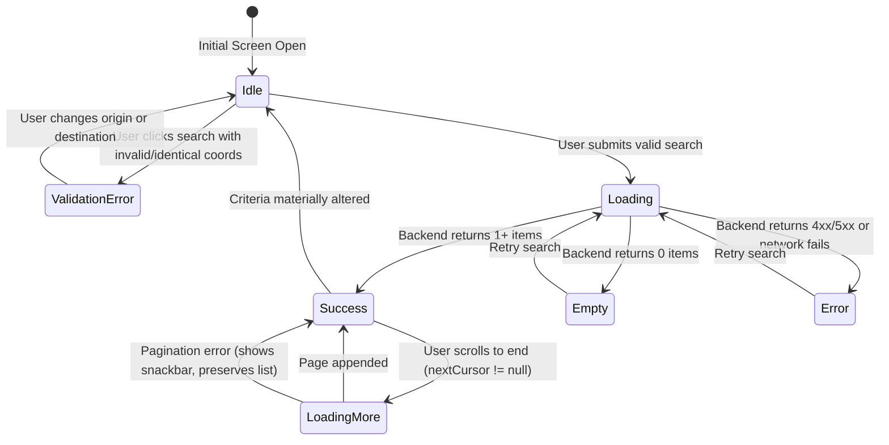

# Phase A09 — Passenger Trip Discovery Architecture & Implementation

## 1. Executive Summary & Objective

Phase A09 establishes the passenger-side Trip Discovery subsystem within the ISHAARA Android application (`/home/dev/Desktop/ishara-frontend`). It empowers authenticated passengers (`USER` role) to:
1. Define and validate trip origin and destination points (reusing A03 location models and validation).
2. Submit geospatial trip discovery requests matching active scheduled/corridor trips.
3. Ingest, parse, and render discoverable trips with strict adherence to backend response structures.
4. Inspect passenger-facing trip details via the authoritative `GET /api/v1/trips/:tripId` endpoint.
5. Select a candidate trip as the handoff anchor for the subsequent Phase A10 (Ride Request Lifecycle).

### Critical Phase Boundaries & Non-Negotiables
- **Discovery Only:** A09 is strictly discovery and trip inspection. No ride requests (`POST /api/v1/ride-requests`) or booking reservations are executed in this phase.
- **Backend as Source of Truth:** Unpermitted fields (such as `seatCapacity`, `seatsRequested`, `availableSeats`, `passengerCount`, speculative fares, or booking metadata) are strictly prohibited from outbound payloads to comply with the backend Zod `.strict()` schema.
- **No Seat Inventory Inference:** The backend discovery engine matches trips based on spatial-temporal corridors; it exposes no seat availability contract at discovery time. Consequently, no seat counts or fake "seats left" UI are rendered.
- **Authoritative Fare Display Only:** Fare estimations are only displayed if returned in the backend response (`estimatedFare` with `currency` and `amount`). No local fare calculations, surge pricing, or payment integrations are performed.
- **No Realtime Streaming:** Live GPS telemetry and WebSocket connections are reserved for Phase A11. Discovery operates via clean, deterministic request-response HTTP APIs.

---

## 2. Architecture Overview

Phase A09 follows the established Clean Architecture with explicit layer segregation:

```
presentation/
    feature/student/discovery/
        DiscoveryScreen.kt              <-- Jetpack Compose UI (Search Bar, Filter, Trip Cards, Empty/Error states)
        DiscoveryViewModel.kt           <-- State Holder, Concurrency Control, Validation & Pagination
        DiscoveryUiState.kt             <-- Immutable MVI UI State (Idle, Loading, Success, Empty, Error, LoadingMore)
        components/
            TripResultCard.kt           <-- Compact, scannable discovered trip card
            TripDetailsSheet.kt         <-- Passenger-facing trip details bottom sheet

domain/
    model/
        DiscoveryModels.kt              <-- DiscoveredTrip, DiscoveryQuery, DiscoveredTripFare, PassengerTripDetails
    repository/
        TripRepository.kt               <-- discoverTrips(), getPassengerTripDetails()
    usecase/
        DiscoverTripsUseCase.kt         <-- Validates query parameters and delegates to repository
        GetPassengerTripDetailsUseCase.kt <-- Fetches authoritative public trip details

data/
    remote/
        dto/DiscoveryDtos.kt            <-- DiscoverySearchRequestDto, DiscoveryResponseDto, PublicTripResponseDto
        datasource/DiscoveryRemoteDataSource.kt <-- Network execution, HTTP headers, RFC 7946 GeoJSON parsing
    mapper/
        DiscoveryMapper.kt              <-- DTO <-> Domain mapping, sanitizing private data
    repository/
        TripRepositoryImpl.kt           <-- Auth token resolution, network delegation, and error normalization
```

---

## 3. Forensic Backend Contract Alignment

A comprehensive forensic audit of `ishara-backend/src/modules/matching/` and `ishara-backend/src/modules/trips/` revealed the exact operational contracts:

### Discovery Request (`POST /api/v1/discovery/trips`)
- **Authentication:** Required (`Bearer <access_token>`).
- **Authorization:** `USER` (Passenger) role.
- **Zod Schema:**
  ```typescript
  z.object({
    origin: z.object({
      latitude: z.number().min(-90).max(90),
      longitude: z.number().min(-180).max(180),
      name: z.string().optional(),
      formattedAddress: z.string().optional(),
    }),
    destination: z.object({
      latitude: z.number().min(-90).max(90),
      longitude: z.number().min(-180).max(180),
      name: z.string().optional(),
      formattedAddress: z.string().optional(),
    }),
    options: z.object({
      maxPickupDistanceMeters: z.number().positive().max(50000).optional(),
      maxDestinationDeviationMeters: z.number().positive().max(50000).optional(),
      maxResults: z.number().int().positive().max(50).optional(),
      cursor: z.string().optional(),
    }).optional(),
  }).strict()
  ```
- **Strict Validation:** Any unknown field (e.g. `fare`, `seats`, `pickup`, `dropoff`) results in an immediate `400 Bad Request` validation error from Zod.

### Trip Details Request (`GET /api/v1/trips/:tripId`)
- **Authentication:** Optional/Authenticated. When queried by non-driver passengers, returns `PublicTripResponse`.
- **Privacy Protections:** Redacts driver phone number and driver license details, exposing only public operational data (`id`, `name`, `profileImageUrl`, `vehicle` details, `route` geometry, and `status`).

---

## 4. UI State Machine & Search Lifecycle

The `DiscoveryViewModel` manages immutable states via Kotlin StateFlow:



### Concurrency & Stale Search Response Protection
When the user rapidly updates search parameters or triggers a new search while a previous HTTP call is in flight, `searchJob?.cancel()` immediately cancels the pending coroutine. A request sequence identifier guarantees that stale async responses cannot overwrite fresh search states.

### Duplicate Submission Prevention
The search trigger checks `currentState.stage is DiscoveryStage.Loading`. If a search is already active, repeated clicks or taps are ignored until the network call settles.

---

## 5. Security & Privacy Policy

1. **Authorization Headers Redaction:** Tokens are resolved dynamically from `SessionLocalDataSource` and injected into the `Authorization: Bearer <token>` header. Http client logging strips/redacts authentication headers.
2. **No Driver PII Leakage:** Only public driver identifiers (`id`, `name`, `profileImageUrl`) are parsed from responses. Private operational data (license numbers, phone numbers, payout identifiers) are neither received nor surfaced.
3. **Account Switching Isolation:** Calling `clearDiscoveryState()` resets all active results, selected trip details, origin/destination inputs, and pagination cursors. When account switching occurs in A02, discovery state is fully cleared to prevent cross-account information leakage.

---

## 6. Verification & Test Coverage

All requirements were verified with a comprehensive unit test suite:
- **Test Suite:** `DiscoveryPhaseA09Test` (16 exhaustive tests)
- **Suite Execution:** 16/16 Passed in 11s.
- **Coverage Areas:**
  - Strict JSON payload serialization against backend Zod schema.
  - Rejection of speculative fields (`seatCapacity`, `fare`, `passengerCount`).
  - Handling of 401 Unauthorized and 403 Forbidden errors.
  - Coordinate range validation (`[-90, 90]`, `[-180, 180]`).
  - Origin = Destination identical location detection and rejection.
  - Empty, multiple result, server error, and network failure responses.
  - RFC 7946 GeoJSON coordinate pair mapping `[longitude, latitude]`.
  - Backend deterministic result ordering preservation.
  - Cursor-based pagination (`nextCursor`).
  - Coroutine cancellation for stale search responses.
  - Authoritative passenger trip details ingestion (`GET /api/v1/trips/:tripId`).
  - Trip selection handoff to A10 boundary without ride-request creation.
  - Account switching state purges.
- **Full Unit Regression:** All test suites passed without failure (`./gradlew testDebugUnitTest`).
- **Build Verification:** Successful debug APK compilation (`./gradlew assembleDebug`).

---

## 7. Deferred Scope (Handed off to A10+)

| Domain | Phase | Responsibility |
|---|---|---|
| Ride Request Creation (`POST /api/v1/ride-requests`) | Phase A10 | Passenger submits ride request for selected discovered trip |
| Driver Accept / Reject / Cancel Flow | Phase A10 | Driver operational response to passenger ride request |
| Live GPS Telemetry & WebSockets | Phase A11 | Real-time vehicle tracking, corridor progression |
| Dynamic Fare Calculation & Surge | Phase A12 | Authoritative pricing engine, rate cards, distance fares |
| Payments & Settlement | Phase A13 | Razorpay / UPI intent creation, payment verification |
