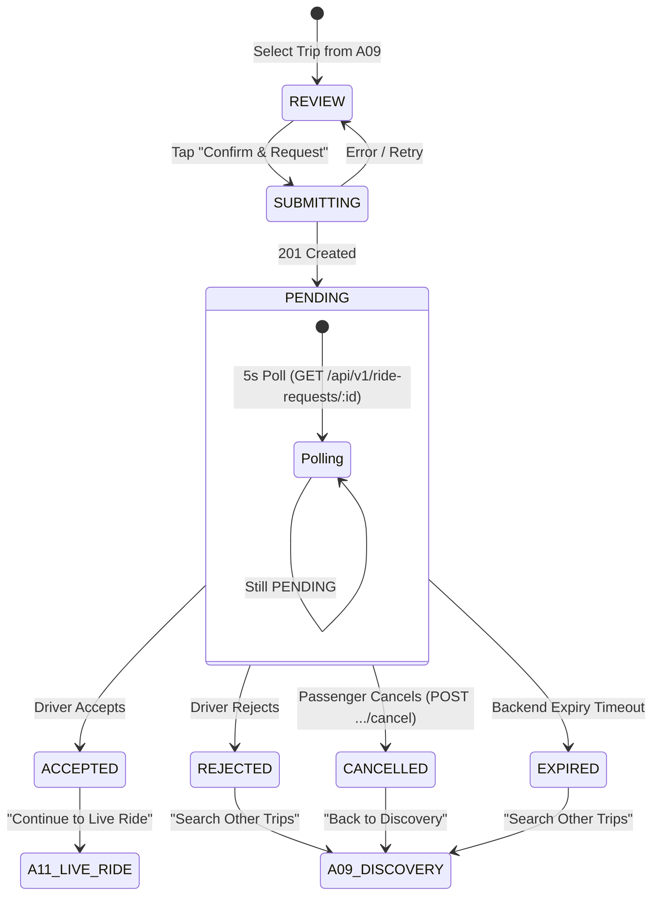

# ISHAARA FRONTEND PHASE A10 — RIDE REQUEST LIFECYCLE

## 1. Overview & Objective
Phase A10 implements the complete, authoritative passenger-side Ride Request Lifecycle for the ISHAARA mobility platform.
Following the A09 Passenger Trip Discovery phase, A10 allows the passenger to:
1. Review the chosen trip and exact pickup/destination points before submitting.
2. Submit a ride request adhering strictly to the backend Zod contract (`POST /api/v1/ride-requests`).
3. Protect against double-taps and network retries using UUIDv4 `Idempotency-Key` headers and UI state locking.
4. Track authoritative request lifecycle states (`PENDING`, `ACCEPTED`, `REJECTED`, `CANCELLED`, `EXPIRED`) via `GET /api/v1/ride-requests/:requestId`.
5. Cancel active `PENDING` ride requests via `POST /api/v1/ride-requests/:requestId/cancel` with backend confirmation.
6. Provide a clean handoff boundary to Phase A11 (Live Ride / Realtime) upon `ACCEPTED` status without implementing live tracking, WebSockets, or GPS streaming in this phase.

---

## 2. Forensic Backend Alignment & Contract Findings
Forensic audit of `ishara-backend/src/modules/ride-requests/` and `src/modules/rides/` established the following backend source of truth:

| Aspect | Backend Reality | Frontend Implementation |
|---|---|---|
| **Creation Endpoint** | `POST /api/v1/ride-requests` | `RideRequestRemoteDataSource.submitRideRequest` |
| **Request Schema** | `{ tripId, pickup: locationInputSchema, destination: locationInputSchema, discoverySessionId? }` with `.strict()` validation | `CreateRideRequestDto` strictly outputs only these 4 fields. Absolutely no `seatsRequested`, `seatCapacity`, `fare`, or `passengerCount`. |
| **Location Validation** | `formattedAddress` (min 2, max 300) and finite `latitude`/`longitude`. Min 50m distance between pickup and destination. | Verified in `RideRequestStrictContractTest` and enforced before submission. |
| **Idempotency** | Supported via `Idempotency-Key` HTTP header. Replayed requests return HTTP 200/201 with original entity. | Unique UUIDv4 generated per user intent and reused across immediate network retries. |
| **Request State Tracking** | `GET /api/v1/ride-requests/:requestId` | `RideRequestRemoteDataSource.getRideRequest` polling every 5s while `PENDING`. |
| **Passenger Cancellation** | `POST /api/v1/ride-requests/:requestId/cancel` with body `{ reason?: string }` (max 250 chars). | `RideRequestRemoteDataSource.cancelRideRequest`. Cancelling non-PENDING requests returns `409 Conflict`. |
| **Request States** | `PENDING`, `ACCEPTED`, `REJECTED`, `CANCELLED`, `EXPIRED`. | Mapped to `RideRequestStatus` enum in domain layer. `isTerminal` extension halts polling immediately. |
| **Ride Creation** | On driver acceptance, backend atomically creates a `Ride` document with `rideRequestId: request.id`. | Captured via `associatedRideId` or `requestId` and passed to A11 route `student/ride/{rideId}`. |

---

## 3. Architecture & Domain Separation
```
com.ishara.app/
├── data/
│   ├── remote/
│   │   ├── dto/RideRequestDtos.kt (CreateRideRequestDto, PassengerCancelRideRequestDto, RideRequestResponseDto, ListRideRequestsResponseDto)
│   │   └── datasource/RideRequestRemoteDataSource.kt (submitRideRequest, getRideRequest, cancelRideRequest, listUserRequests)
│   ├── mapper/RideRequestMapper.kt (GeoJSON RFC 7946 coordinate extraction & ISO timestamp formatting)
│   └── repository/RideRepositoryImpl.kt (orchestrates data source, handles error mapping)
├── domain/
│   ├── model/RideRequestModels.kt (RideRequestInput, RideRequestResult, RideRequestStatus)
│   ├── repository/RideRepository.kt
│   └── usecase/
│       ├── SubmitRideRequestUseCase.kt
│       ├── GetRideRequestUseCase.kt
│       ├── CancelRideRequestUseCase.kt
│       ├── GetUserRideRequestsUseCase.kt
│       └── ClearRideRequestStateUseCase.kt
└── feature/student/riderequest/
    ├── RideRequestReviewScreen.kt (review trip, origin/destination, submit button)
    ├── RideRequestViewModel.kt (submitting state, idempotency key generation, navigation to status)
    ├── RideRequestStatusScreen.kt (status tracking badges, trip route cards, cancel dialog, A11 continue button)
    ├── RideRequestStatusViewModel.kt (authoritative status polling, cancellation action, A11 handoff)
    └── RideRequestStatusUiState.kt (immutable UDF UI state)
```

### Strict Domain Separation: RideRequest vs Ride
- **`RideRequest`**: Represents a passenger's prospective booking request to join a trip. Has statuses: `PENDING`, `ACCEPTED`, `REJECTED`, `CANCELLED`, `EXPIRED`.
- **`Ride`**: The authoritative post-acceptance transit agreement created on the backend when a driver accepts the request. Belongs to Phase A11. A10 handles ONLY the handoff (`student/ride/{rideId}`).

---

## 4. State Machine & Polling Strategy


### Polling Implementation Rules:
1. Polling is strictly bounded to 5-second intervals via Kotlin Coroutines.
2. Polling runs exclusively while `status == PENDING`.
3. Polling terminates immediately when any terminal state (`ACCEPTED`, `REJECTED`, `CANCELLED`, `EXPIRED`) is detected or when the ViewModel is cleared (`onCleared`).
4. Realtime WebSockets are strictly deferred to Phase A11.

---

## 5. Security & Session Hygiene
- **Account Switching & Logout Protection:** `ClearRideRequestStateUseCase` clears local in-flight request IDs and cached trip states on logout or account switch.
- **Header & Token Security:** Authentication tokens (`Bearer <jwt>`) are handled transparently by the secure HTTP client layer. No authorization headers or raw tokens are logged.
- **PII Scrubbing:** Pickup and dropoff coordinates and formatted addresses are only displayed on screen and sent to the validated backend API; never persisted to unencrypted logs.
- **No Optimistic Fake Transitions:** UI state never assumes `ACCEPTED` or `CANCELLED` until the backend returns an authoritative `200/201` HTTP response.

---

## 6. Handoff to Phase A11
When the backend marks a request `ACCEPTED`:
1. The status screen presents a green `Accepted` badge and displays the driver and vehicle information if available.
2. The primary CTA becomes **"Continue to Live Ride"**.
3. Tapping this triggers `RideRequestStatusViewModel.onContinueToLiveRide()`, which routes to `student/ride/{rideId}` (`IshaaraDestination.StudentRideTracking`).
4. Phase A10 ceases execution and hands off state authority cleanly to Phase A11.
