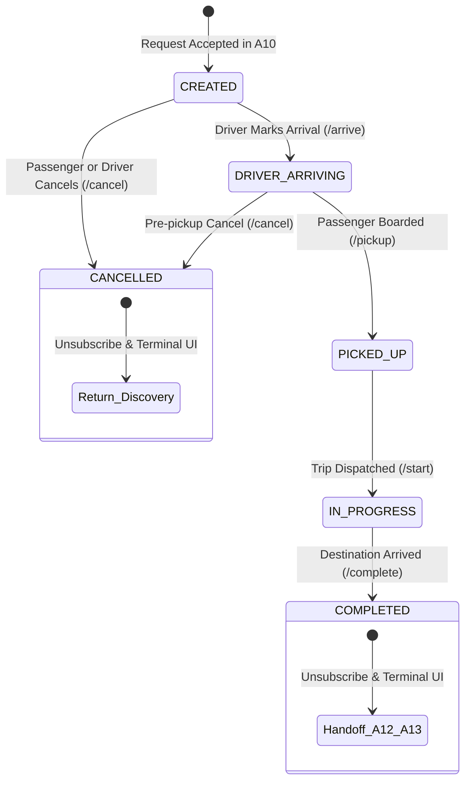

# ISHAARA FRONTEND PHASE A11 — LIVE RIDE, REALTIME STATE & GPS FOUNDATION

## 1. Overview & Objective
Phase A11 establishes the production-grade realtime foundation for active rides on the ISHAARA mobility platform.
Following the A10 Ride Request Lifecycle (which culminates in an accepted ride and transitions to `student/ride/{rideId}`), Phase A11 provides:
1. Realtime bidirectional WebSocket connection to `/api/v1/rides/realtime` with session authentication.
2. Explicit ride tracking subscription protocol using `RIDE_TRACKING_SUBSCRIBE` and `RIDE_TRACKING_UNSUBSCRIBE`.
3. Authoritative initial snapshot hydration and reconnect reconciliation via `GET /api/v1/rides/:rideId/tracking`.
4. Continuous driver location ingestion and freshness tracking (`FRESH` vs `STALE` vs `UNAVAILABLE`).
5. Authoritative backend ride state machine execution (`CREATED` -> `DRIVER_ARRIVING` -> `PICKED_UP` -> `IN_PROGRESS` -> `COMPLETED` / `CANCELLED`).
6. Driver-side location capture coordinator (`DriverTrackingCoordinator`) enforcing monotonic GPS timestamps and freshest-only offline buffering.
7. Resilience against network degradation, exponential backoff reconnection, and graceful error isolation for unknown server events.

---

## 2. Forensic Backend Alignment & Realtime Architecture
Forensic inspection of `ishara-backend/src/modules/realtime/`, `src/modules/rides/`, and `src/modules/tracking/` revealed:

| Aspect | Backend Reality | Frontend Implementation |
|---|---|---|
| **Realtime Endpoint** | WebSocket upgrade on `/api/v1/rides/realtime` (or `/api/v1/ride-requests/realtime`). | `OkHttpRealtimeClient` connects to `${networkConfig.fullWebSocketBaseUrl}/rides/realtime?token=<jwt>`. |
| **Authentication** | Bearer token verified in HTTP upgrade handshake (`?token=` or `Authorization: Bearer`). Validates Better Auth session. | `OkHttpRealtimeClient.buildAuthenticatedUrl` passes the session token; tokens are sanitized in all logs. |
| **Authorization** | Caller must be the passenger (`userId == ride.userId`) or assigned driver (`driverProfileId == ride.driverId`). Terminal rides cannot be subscribed. | Verified in `RealtimePhaseA11Test`. `RideTrackingRepositoryImpl` enforces `UserRole.USER` for passenger tracking. |
| **Subscription Protocol** | Client sends JSON text frame: `{"type": "RIDE_TRACKING_SUBSCRIBE", "payload": {"rideId": "<id>"}}`. | Dispatched by `RideTrackingRepository.subscribeToRideTracking(rideId)`. |
| **Initial Snapshot** | Backend immediately emits `TRACKING_SNAPSHOT` upon subscription, matching `GET /api/v1/rides/:rideId/tracking`. | Handled by `RealtimeEventParser` and ingested into `RideTrackingViewModel`. |
| **State Transitions** | Backend publishes `RIDE_DRIVER_ARRIVING`, `RIDE_PICKED_UP`, `RIDE_STARTED`, `RIDE_COMPLETED`, `RIDE_CANCELLED`. | Handled in `RealtimeEventParser` and mapped directly to `TrackingRideStatus`. |
| **Driver GPS Updates** | Server emits `DRIVER_LOCATION_UPDATED` or `RIDE_TRACKING_UPDATED`. | Parsed into `TrackingDriverLocation` with coordinates, accuracy, speed, heading, and freshness. |
| **Reconnection & Reconciliation** | Realtime failure or network drop triggers reconnect with exponential backoff (1s, 2s, 4s, 8s, 16s). Reconnect is followed by silent authoritative REST snapshot query. | `RideTrackingViewModel.refreshAuthoritativeStateSilently()` executes after reconnection to repair missed events. |

---

## 3. Ride Lifecycle State Machine

### State Rules:
- **Terminal States:** `COMPLETED` and `CANCELLED`.
- **Cancellation Policy:** Only permitted while in `CREATED` or `DRIVER_ARRIVING`. Disallowed once passenger is `PICKED_UP`.
- **Cleanup Rule:** Transition to terminal status triggers immediate WebSocket unsubscription and stops driver location publishing.

---

## 4. Driver GPS Architecture (`DriverTrackingCoordinator`)
1. **Monotonic Timestamp Enforcement:** Discards any GPS fix whose timestamp is less than or equal to the previous sent timestamp.
2. **Freshest-Only Offline Policy:** If network is lost during trip operation, at most ONE freshest location coordinate is buffered to avoid flooding the server with stale historical points upon reconnect.
3. **Physical Bound Checks:** Rejects coordinates where latitude is outside `[-90, 90]` or longitude outside `[-180, 180]`.
4. **Lifecycle Control:** Active only during in-flight trips; automatically halted when the trip completes or on driver logout.

---

## 5. Security & Session Integrity
- **Token Sanitation:** All WebSocket connection URLs and network logs sanitize `?token=` parameters.
- **Session Expiry Coordination:** Handshake rejection (HTTP 401/403 or close code 4401/1008) alerts `SessionInvalidationCoordinator` to trigger re-authentication.
- **Account Switching:** When account switches or logout occurs, existing WebSockets close with normal closure code (1000) and active tracking coroutines are cancelled.

---

## 6. Handoff to Subsequent Phases
- **Phase A12 (Fare / Pricing):** A11 provides the authoritative completed ride reference. A12 will consume `GET /api/v1/rides/:rideId/fare`.
- **Phase A13 (Payments):** Triggered when ride completes via `onPayFareClicked()`, routing to `student/ride/{rideId}/payment`.
- **Phase A14 (Safety / Ratings):** SOS button routes to `student/safety/{rideId}` (`IshaaraDestination.StudentSafety`).
