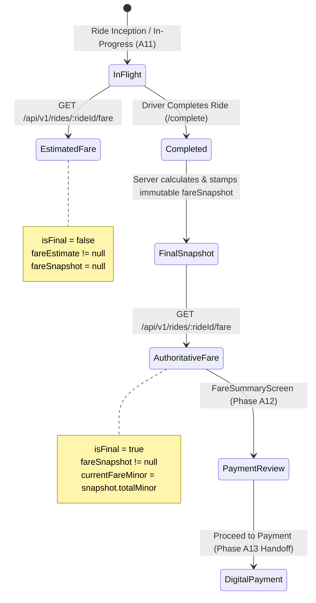

# ISHAARA FRONTEND PHASE A12 — FARE & PRICING FOUNDATION

## 1. Overview & Objective
Phase A12 establishes the frontend foundation for **Authoritative Fare & Pricing** on the ISHAARA platform.
The architecture enforces a strict non-negotiable principle:

```
BACKEND FARE CALCULATION
        ↓
AUTHORITATIVE FARE RESPONSE / SNAPSHOT
        ↓
ANDROID FRONTEND (A12)
        ↓
FARE DISPLAY / REVIEW
        ↓
DIGITAL PAYMENTS (A13)
```

The frontend operates strictly as an authoritative **consumer** of backend pricing and billing calculations. Under no circumstances does the client independently calculate or alter the final payable fare.

---

## 2. Forensic Backend Alignment & Authority Rules
Forensic inspection of `ishara-backend/src/modules/payments/fare.service.ts`, `fare.types.ts`, `pricing-policy.ts`, and `ishara-backend/src/modules/rides/ride.service.ts` revealed:

| Aspect | Backend Reality | Frontend Implementation |
|---|---|---|
| **Fare Endpoint** | `GET /api/v1/rides/:rideId/fare` | `DefaultFareRemoteDataSource.getRideFare(rideId, token)` |
| **Authentication** | Bearer JWT token in HTTP header (`Authorization: Bearer <token>`) | Handled via `SessionLocalDataSource`; tokens sanitized from all logs |
| **Authorization / IDOR** | Caller must be the owning passenger (`userId == ride.userId`) or assigned driver (`driverProfileId == ride.driverId`). Other users get `403 Forbidden` (`RIDE_NOT_AUTHORIZED`). | Handled in `DefaultFareRemoteDataSource` and tested in `FarePhaseA12Test` |
| **Fare Owner** | The Fare belongs to the **Ride** entity (`rideId`). | Referenced via `rideId` context across repository, use case, ViewModel, and UI |
| **Money Representation** | All amounts are **strictly integer minor currency units** (paise in INR, e.g. 4500 = ₹45.00). Floating-point money is prohibited across the backend platform. | Encapsulated in domain `Money(amountMinor: Long, currency: String)` |
| **Pre-Ride / In-Flight** | Returns estimated fare projection (`fareEstimate` with `isEstimate: true`, `isFinal: false`, `fareSnapshot: null`). | Mapped to `FareEstimate` domain model and displayed with "ESTIMATED FARE PROJECTION" badge |
| **Post-Ride / Completed** | Stamped upon ride completion (`completeRide`); produces immutable `fareSnapshot` with `isEstimate: false`, `isFinal: true`. | Mapped to `FareSnapshot` domain model and displayed with "AUTHORITATIVE FINAL FARE" badge |
| **Calculation Immutability** | Once stamped upon completion, `fareSnapshot` must NOT change retroactively. | Immutable domain model; client never recalculates or modifies snapshot values |
| **Payment Handoff** | Phase A13 payments consume `ride.fareSnapshot.totalMinor`. Client cannot provide or alter payment amounts. | `FareSummaryViewModel.onProceedToPayment()` hands off to `StudentPayment` (`student/ride/{rideId}/payment`) |

---

## 3. Money Representation & Invariants
1. **Integer Representation:** All monetary values are maintained as 64-bit integers (`Long`) in minor currency units (paise for INR).
2. **Zero Floating-Point Calculations:** No floating-point arithmetic is performed on monetary figures.
3. **Display Formatting:** Centralized via `Money.formatDisplay()`, rendering `₹XX.XX` using Indian locale conventions (`en-IN`) without string concatenation in composables.
4. **Negative Value Guard:** Negative monetary values are rejected or clamped to zero to prevent invalid ledger balances.

---

## 4. Fare Lifecycle & State Machine



---

## 5. Security & Session Integrity
- **IDOR Protection:** Backend enforces that only the owning passenger or assigned driver can query `GET /api/v1/rides/:rideId/fare`. Frontend maps `403 Forbidden` to `IshaaraError.Forbidden` with friendly user messaging.
- **Session Isolation:** Calling `clearFareState()` or signing out completely wipes the in-memory fare repository cache, preventing data leakage across accounts.
- **Client Invariance:** The frontend treats the backend `currentFareMinor` as absolute truth; no client formulas can override or modify the total.

---

## 6. Handoff to Phase A13 (Payments)
- **Boundary Rule:** Phase A12 concludes once the authoritative fare is reviewed and displayed to the user.
- **Action:** Tapping "Proceed to Payment" routes directly to `student/ride/{rideId}/payment` where Phase A13 orchestrates the Razorpay order creation and checkout session.
- **No Payment SDK in A12:** No payment gateways, cards, UPI intents, or payment records are handled in Phase A12.
