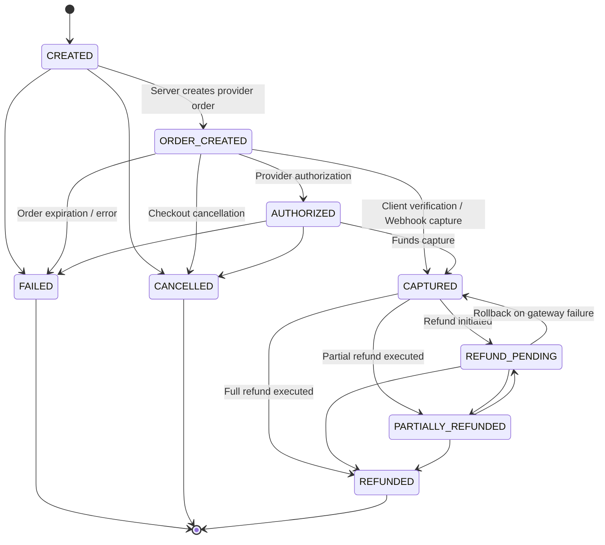

# ISHAARA FRONTEND PHASE A13 — PAYMENTS & PAYMENT LIFECYCLE

## 1. Primary Objective & Architectural Foundation
Phase A13 establishes the **USER / Passenger Payment Foundation** for the ISHAARA mobility platform.
Following Phase A12 (Fare & Pricing Foundation), Phase A13 implements the authoritative lifecycle:

```
AUTHORITATIVE FARE (A12)
        ↓
FARE REVIEW & HANDOFF
        ↓
PAYMENT INITIATION (POST /api/v1/rides/:rideId/payment)
        ↓
CHECKOUT SESSION (Razorpay / UPI Intent)
        ↓
PAYMENT PROCESSING & GATEWAY CHECKOUT
        ↓
BACKEND CRYPTOGRAPHIC VERIFICATION (POST /api/v1/payments/:paymentId/verify)
        ↓
AUTHORITATIVE PAYMENT STATE (CAPTURED / REFUNDED / FAILED)
        ↓
HANDOFF TO SAFETY / RATINGS (A14)
```

The frontend operates under the strict rule that **client-side callbacks alone are NEVER proof of payment success**. The backend payment gateway and verification endpoint are strictly authoritative.

---

## 2. Forensic Backend Alignment & Authority Rules
Forensic audit of `ishara-backend/src/modules/payments/` (`payment.controller.ts`, `payment.service.ts`, `payment.schema.ts`, `payment.state-machine.ts`, `payment.constants.ts`, `payment-webhook.service.ts`, `payment-provider/razorpay.provider.ts`, and `phase13-payment-processing.test.ts`) established the following authoritative invariants:

| Parameter | Backend Implementation Reality | Frontend Architectural Implementation |
|---|---|---|
| **Payment Provider** | Razorpay (or `mock` provider in local/test sandbox mode) | Integrated via `PaymentLauncher` and `DefaultPaymentLauncher` supporting UPI intents and test simulation |
| **Provider Credentials** | Public `keyId` provided in `CheckoutSessionDetails`; `RAZORPAY_KEY_SECRET` resides strictly server-side | Zero secret keys in APK or Android code; public `keyId` dynamically consumed |
| **Payment Entity Owner** | Associated directly with `Ride` (`rideId`), initiated by owning passenger (`userId`), viewable by assigned `driverId` | Identified by `rideId` across ViewModel, repository, and domain models |
| **Payment Initiation Endpoint** | `POST /api/v1/rides/:rideId/payment` (with alias `/payment/order`) | `PaymentRemoteDataSource.createPaymentOrder` |
| **Strict Schema Enforcement** | `createPaymentOrderSchema` uses `.strict()`, allowing ONLY `{ idempotencyKey?: string }`. Any client `amount`, `currency`, or `fareOverrideMinor` is rejected with `400 Bad Request` | Client NEVER sends amount or currency; consumes authoritative fare from backend |
| **Amount Ownership** | Authoritative `ride.fareSnapshot.totalMinor` calculated in Phase A12; strictly integer minor units (paise in INR) | Domain `Money(amountMinor: Long, currency: String)` |
| **Idempotency** | Supported via HTTP header `Idempotency-Key` and body `idempotencyKey`; returns identical session on duplicate requests | Generated once per checkout session via `UUID.randomUUID().toString()`, reused on network retries |
| **Payment Verification Endpoint** | `POST /api/v1/payments/:paymentId/verify` with body `{ providerOrderId, providerPaymentId, signature }` | `PaymentRemoteDataSource.verifyPayment` invoked upon provider checkout completion |
| **Verification Logic** | Server computes HMAC-SHA256(`providerOrderId|providerPaymentId`, secret) and atomically transitions status to `CAPTURED`, sets `capturedAt`, and marks `ride.paymentStatus = 'PAID'` | Frontend transitions to `Paid` state only AFTER verification succeeds |
| **Verification Idempotency** | Repeated verification of already `CAPTURED` payment returns 200 OK with captured payment document | Safely handled without duplicate debit or error |
| **Status Check Endpoint** | `GET /api/v1/rides/:rideId/payment` returns latest authoritative `PaymentRecord` | Used during initial load and lifecycle recovery to detect pre-existing captured, refunded, or failed state |
| **Webhook Authority** | Ingests `payment.captured` with signature verification; backend atomically resolves races between client verify and webhook | Frontend relies on authoritative state lookup rather than local trust |

---

## 3. Authoritative Payment State Machine

Reconstructed strictly from `payment.state-machine.ts` and `payment.constants.ts`:



### State Machine Transition Invariants
1. **Terminal States:** `FAILED`, `CANCELLED`, `REFUNDED` cannot transition to any other active state.
2. **Same-State Transitions:** Idempotent transitions (`CAPTURED -> CAPTURED`) are valid and permitted.
3. **Capture Precondition:** Only payments in `ORDER_CREATED` or `AUTHORIZED` status can transition to `CAPTURED`.

---

## 4. UI/UX States & Passenger Experience

The UI adheres strictly to ISHAARA Design System components (`IshaaraTheme`, `IshaaraCard`, `IshaaraButton`, `IshaaraStatusChip`, `IshaaraBadge`):

1. **`PaymentUiState.Loading`:** Initializing order or verifying state.
2. **`PaymentUiState.OrderReady`:** Displays ride context (Pickup & Destination), authoritative total fare, payment method badge ("UPI / Online Payment"), and primary CTA `Pay ₹XX.XX`.
3. **`PaymentUiState.Verifying`:** Rendered while verifying provider signature with backend; prevents double-tap and displays "Confirming payment with bank…".
4. **`PaymentUiState.Paid`:** Rendered upon authoritative backend capture. Displays digital ride receipt with Amount Paid, Payment ID, Provider Reference, and CTA to "Track Live Ride" (handoff to Phase 11 / A14).
5. **`PaymentUiState.Refunded`:** Displays authoritative refund status chip, original fare, refunded amount, and return button.
6. **`PaymentUiState.PaymentFailed`:** Displays failure notice, status chip, and "Retry Payment" CTA.
7. **`PaymentUiState.Error`:** Actionable error state with retry support for transient network failures.

---

## 5. Security & Session Integrity Audit
- **Zero Secret Keys in APK:** Scanned all Gradle configs, BuildConfig, assets, strings.xml, and Kotlin sources. Zero secret signing keys or API secrets present.
- **Client Amount Invariant:** Android client contains no capability to alter, calculate, or inject payment amounts or currencies.
- **IDOR Protection:** Verified `403 Forbidden` response handling when unauthorized users attempt to create or inspect payment orders.
- **Account Switching & Cache Isolation:** `clearPaymentStateUseCase` ensures cached payment sessions and authorizations are immediately purged on logout.
