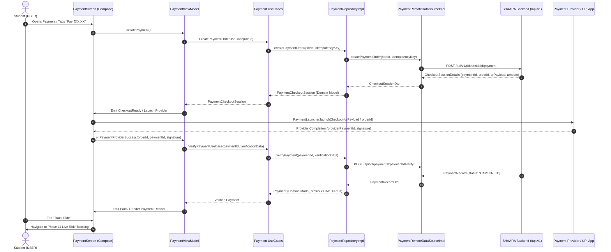
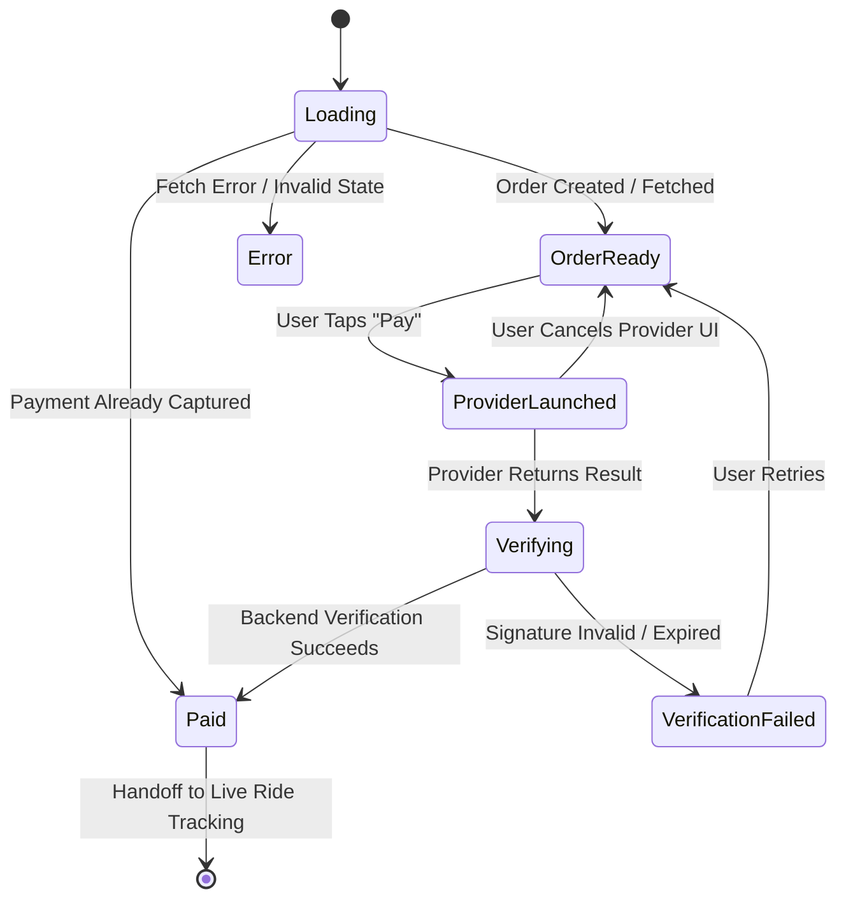

# ISHAARA — Payment, Fare & Digital Receipt Architecture
**Phase 13: Production Android Architecture**

---

## 1. Architectural Mission & Core Principles

The primary principle of Phase 13 is:
> **NEVER TRUST THE CLIENT AS THE SOURCE OF TRUTH FOR MONEY.**

The backend is authoritative for:
1. Determining fare breakdown in integer minor units (paise).
2. Generating and signing gateway payment orders.
3. Performing cryptographic verification of provider payment signatures.
4. Mutating ride payment statuses (`UNPAID` $\rightarrow$ `PENDING` $\rightarrow$ `PAID`).
5. Recording double-entry ledger entries.

The Android client is responsible for:
1. Displaying authoritative fare amounts (rendered as `₹XX.XX`).
2. Initiating checkout sessions safely with idempotency protection.
3. Handing off checkout to the payment provider (UPI intent launcher or gateway checkout).
4. Submitting provider completion artifacts (`providerOrderId`, `providerPaymentId`, `signature`) to the backend verification endpoint.
5. Displaying the authoritative payment receipt upon confirmed capture.
6. Handing off the paid ride into Phase 11 Live Ride Tracking.

---

## 2. End-to-End Architectural Data Flow



---

## 3. Domain Model Architecture

### 3.1 Centralized Money Model
```kotlin
data class Money(
    val amountMinor: Long,
    val currency: String = "INR"
) {
    init {
        require(amountMinor >= 0) { "Amount minor cannot be negative: $amountMinor" }
    }

    val amountMajor: Double
        get() = amountMinor.toDouble() / 100.0

    fun formatDisplay(): String {
        return when (currency.uppercase()) {
            "INR" -> String.format(java.util.Locale.forLanguageTag("en-IN"), "₹%.2f", amountMajor)
            else -> String.format(java.util.Locale.US, "$currency %.2f", amountMajor)
        }
    }
}
```

### 3.2 Payment Models
```kotlin
enum class DomainPaymentStatus {
    CREATED,
    ORDER_CREATED,
    AUTHORIZED,
    CAPTURED,
    FAILED,
    CANCELLED,
    REFUND_PENDING,
    PARTIALLY_REFUNDED,
    REFUNDED,
    UNKNOWN;

    val isCaptured: Boolean get() = this == CAPTURED
}

data class PaymentCheckoutSession(
    val paymentId: String,
    val rideId: String,
    val fare: Money,
    val provider: String,
    val providerOrderId: String,
    val keyId: String?,
    val qrPayload: String?,
    val expiresAt: String
)

data class Payment(
    val id: String,
    val rideId: String,
    val userId: String,
    val driverId: String,
    val grossFare: Money,
    val platformFee: Money,
    val driverShare: Money,
    val status: DomainPaymentStatus,
    val providerOrderId: String,
    val providerPaymentId: String?,
    val capturedAt: String?,
    val createdAt: String
)

data class PaymentVerificationRequest(
    val providerOrderId: String,
    val providerPaymentId: String,
    val signature: String
)

data class RideReceipt(
    val paymentId: String,
    val rideId: String,
    val amount: Money,
    val providerPaymentId: String?,
    val capturedAt: String,
    val pickupAddress: String?,
    val destinationAddress: String?
)
```

---

## 4. Payment Launcher Abstraction

The payment checkout launcher is abstracted via [`PaymentLauncher`](file:///home/dev/Desktop/ishara-frontend/app/src/main/java/com/ishara/app/core/payment/PaymentLauncher.kt), keeping the UI and ViewModel completely independent of external SDK details.
- In production, it can dispatch UPI Intent intents (`Intent.ACTION_VIEW` targeting `qrPayload` uri `upi://pay?...`) or Razorpay Checkout.
- In test/debug mode, if Razorpay SDK or UPI app is not installed, it offers an instant simulated test confirmation producing verifiable test signatures.

---

## 5. UI State Machine (`PaymentUiState`)



---

## 6. Security & Sensitive Data Handling

1. **Zero Secret Keys in APK**: No Razorpay Secret, API secret, or signing keys are embedded in Android code.
2. **Zero Card/CVV Storage**: The application never touches or logs credit card numbers, CVVs, or UPI PINs.
3. **Redacted Logs**: Tokens and sensitive headers are redacted by `DefaultIshaaraHttpClient`.
4. **Authoritative Signature Verification**: Client never marks a payment as successful based on client callback alone; verification happens server-side with HMAC-SHA256.

---

## 7. Lifecycle & Process Death Resilience

1. `rideId` is passed via navigation state.
2. If process recreation occurs during payment, `PaymentViewModel` queries `GET /api/v1/rides/:rideId/payment`. If a captured payment exists, it transitions directly to `Paid`/`Receipt`. If an active order exists, it resumes checkout seamlessly without duplicate charges.
3. Duplicate tap protection is enforced via `isProcessing` guards and `Job` tracking in `PaymentViewModel`.
